  <picture>
    
  </picture>

  <picture>
    
  </picture>

  

  <picture>
    
  </picture>

  <picture>
    
  </picture>

  

  <picture>
    
  </picture>

  <picture>
    
  </picture>

  <table>
    <tr>
      <td>
        
      </td>
      <td>
        
      </td>
    </tr>
  </table>

  <picture>
    <source media="(prefers-color-scheme: dark)" srcset="https://raw.githubusercontent.com/tanmaymish/tanmaymish/output/github-contribution-grid-snake-dark.svg">
    <source media="(prefers-color-scheme: light)" srcset="https://raw.githubusercontent.com/tanmaymish/tanmaymish/output/github-contribution-grid-snake.svg">
    
  </picture>

  <picture>
    
  </picture>

