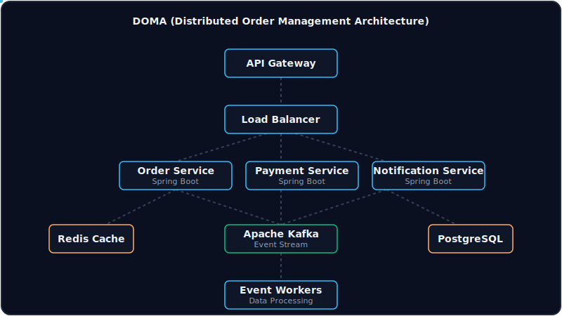

  <picture>
    
  </picture>

 

  <picture>
    
  </picture>

 

## 🧑‍💻 System Initialization: `whoami`

  <picture>
    
  </picture>

---

## 🚀 Flagship Mission: HunterMind

**Automated Threat Intelligence Engine**
> HunterMind orchestrates OSINT and vulnerability scanning workflows using a distributed task queue with Redis and Celery. 

- **Stack:** Python, Go, Docker, AWS
- **Architecture:** Microservices-based distributed scanning pipeline.
- **Modules:** Recon, Subdomains, DNS, CT Logs, ASN, Wayback, GitHub, API Discovery, AI Analysis, Risk Scoring

*Status: Under Active Development.*

---

## 🏗 Distributed Systems Engineering

  <picture>
    
  </picture>

### Projects & Engineering Experience

| Mission | Role / Tech Stack | Status Report |
| :--- | :--- | :--- |
| **DOMA** | *Spring Boot, Kafka, PostgreSQL* | High-throughput order processing system mimicking Swiggy/Zomato logistics. |
| **Vision** | *Software Engineering Intern* | Redesigned order management service resulting in a 30% execution speedup. |
| **FileGuard** | *Python, Flask, Celery, React* | File Integrity Monitoring System achieving 99.9% detection accuracy. |
| **Oil Spill Detection** | *Python, ML, GIS, Satellite* | Smart India Hackathon Finalist. Reduced alert times by 40%. |
| **GSoC 2019** | *PHP, WebSockets, REST APIs* | Submitty Core Contributor. Built WebSocket-based real-time forum modules. |

---

## 🛡 Cyber Operations & Security Research

- **Researcher @ Bugcrowd & HackerOne:** Discovered and reported 25+ CVEs/vulnerabilities.
- **Certifications:** 
  - GRC and Cybersecurity (IFS Pune)
  - DDoS Attack and Defense 
  - Advanced System Security
  - Cloud Computing Security

  <picture>
    
  </picture>

---

## 📈 GitHub Telemetry

  <table>
    <tr>
      <td>
        
      </td>
      <td>
        
      </td>
    </tr>
  </table>
  
   

  <picture>
    <source media="(prefers-color-scheme: dark)" srcset="https://raw.githubusercontent.com/tanmaymish/tanmaymish/output/github-contribution-grid-snake-dark.svg">
    <source media="(prefers-color-scheme: light)" srcset="https://raw.githubusercontent.com/tanmaymish/tanmaymish/output/github-contribution-grid-snake.svg">
    
  </picture>

 

  <picture>
    
  </picture>

